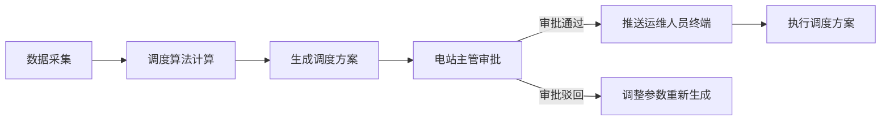
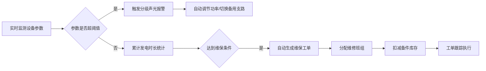
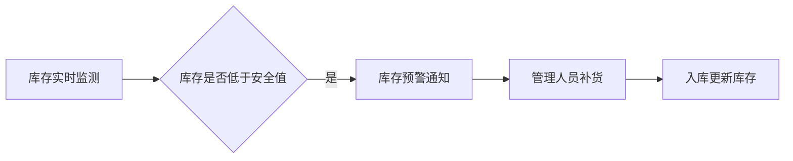

## 1. 产品概述

大型太阳能电站智能运维与发电预测桌面系统，通过实时接入气象数据、组件温度、逆变器状态等多维度数据，实现智能化发电调度、设备运维管理、实时监测报警及统计分析功能。面向电站主管、运维人员和管理人员，提升发电效率、降低运维成本。

## 2. 核心功能

### 2.1 用户角色

| 角色 | 注册方式 | 核心权限 |
|------|----------|----------|
| 电站主管 | 系统分配 | 审批调度方案、查看全部数据、管理用户权限 |
| 运维人员 | 系统分配 | 接收工单、执行维保、上报设备状态 |
| 系统管理员 | 系统分配 | 系统配置、用户管理、数据备份 |

### 2.2 功能模块

1. **实时监控大屏**：气象数据、发电数据、设备状态、报警信息实时展示
2. **发电调度管理**：自动生成每日调度方案、方案审批、调度执行
3. **设备运维管理**：设备状态监测、维保工单生成、工单分配与跟踪
4. **库存管理**：备件库存、出入库记录、库存预警
5. **统计报表**：发电量统计、设备可用率、等效利用小时、PDF报告导出
6. **电站布局可视化**：设备状态热力图、发电效率分布图、实时设备状态

### 2.3 页面详情

| 页面名称 | 模块名称 | 功能描述 |
|----------|----------|----------|
| 登录页 | 登录表单 | 账号密码登录、角色识别 |
| 监控大屏 | 实时指标卡片 | 总发电量、实时功率、等效利用小时、设备可用率 |
| 监控大屏 | 气象数据面板 | 光照辐射度、环境温度、风速、湿度、组件温度 |
| 监控大屏 | 发电趋势图 | 24小时发电曲线、光照辐射曲线 |
| 监控大屏 | 设备状态总览 | 逆变器、组串、储能电池状态统计 |
| 监控大屏 | 实时报警面板 | 分级报警显示、声光报警提示 |
| 发电调度 | 调度方案列表 | 每日调度方案、状态筛选、方案详情 |
| 发电调度 | 方案审批 | 方案详情查看、审批/驳回操作 |
| 发电调度 | 调度参数配置 | 清洗阈值、效率阈值、SOC约束配置 |
| 设备运维 | 设备列表 | 逆变器、组件、储能电池列表、状态筛选 |
| 设备运维 | 工单管理 | 维保工单列表、工单分配、工单状态跟踪 |
| 设备运维 | 维保记录 | 历史维保记录、维修详情 |
| 库存管理 | 备件库存 | 备件列表、库存数量、安全库存预警 |
| 库存管理 | 出入库记录 | 入库出库流水、扣减记录 |
| 统计报表 | 数据统计 | 按方阵/时间段统计发电量、利用小时、可用率 |
| 统计报表 | 报告导出 | PDF月度运营分析报告导出 |
| 电站布局 | 布局可视化 | 电站方阵布局图、设备热力分布、发电效率变化 |

## 3. 核心流程

### 3.1 发电调度流程
系统每日自动根据历史发电效率、光照辐射度、设备健康度生成发电调度方案，考虑组件清洗周期（效率下降10%触发清洗工单）、逆变器转换效率下降阈值和储能电池SOC约束。方案生成后推送至电站主管审批，审批通过后推送至运维人员终端执行。

### 3.2 设备运维流程
实时监测组串电流、电压和逆变器温度，超阈值触发分级声光报警并自动调节发电功率或切换备用支路。系统按累计发电时长和故障率自动生成维保工单，分配维修班组并扣减备件库存。

### 3.3 库存预警流程
备件库存低于安全库存时自动触发预警，通知管理人员及时补货。

## 4. 用户界面设计

### 4.1 设计风格
- **主色调**：深蓝科技感配色 (#0A1628)，辅以太阳能橙色 (#FF8C00) 和能源绿色 (#00C853)
- **辅助色**：报警红 (#FF3D00)、警告黄 (#FFD600)、正常绿 (#00E676)
- **按钮风格**：扁平化圆角按钮，悬停有发光效果
- **字体**：使用 JetBrains Mono 等宽字体显示数据，搭配思源黑体显示中文
- **布局风格**：深色科技感仪表盘风格，卡片式模块布局，大量使用数据可视化图表
- **图标风格**：使用 Lucide 图标库，线性风格图标

### 4.2 页面设计概述

| 页面名称 | 模块名称 | UI元素 |
|----------|----------|--------|
| 监控大屏 | 实时指标卡片 | 深色渐变背景、发光数字、趋势箭头、脉冲动画 |
| 监控大屏 | 气象数据面板 | 半透明玻璃拟态卡片、图标+数据展示、实时更新动画 |
| 监控大屏 | 发电趋势图 | 面积图、双Y轴、渐变填充、动态数据刷新 |
| 监控大屏 | 设备状态总览 | 状态环形图、颜色编码统计、设备分类标签 |
| 监控大屏 | 实时报警面板 | 时间线布局、分级颜色、闪烁报警动画 |
| 发电调度 | 调度方案列表 | 表格布局、状态标签、审批操作按钮 |
| 发电调度 | 方案详情 | 左右分栏布局、调度参数卡片、审批操作区 |
| 设备运维 | 设备列表 | 可筛选表格、状态颜色编码、快速操作按钮 |
| 设备运维 | 工单管理 | 看板视图、拖拽状态流转、工单详情抽屉 |
| 库存管理 | 备件库存 | 卡片网格、库存进度条、预警高亮 |
| 统计报表 | 数据统计 | 多维度筛选器、柱状图+折线图组合、数据表格 |
| 电站布局 | 布局可视化 | SVG/Canvas 热力图、悬浮提示、设备状态颜色映射 |

### 4.3 响应式
桌面优先设计，适配 1920×1080 及以上分辨率，支持响应式布局至 1366×768。
