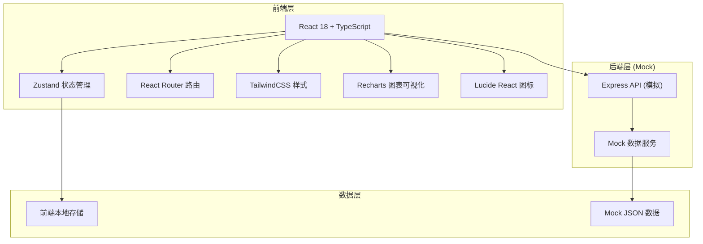
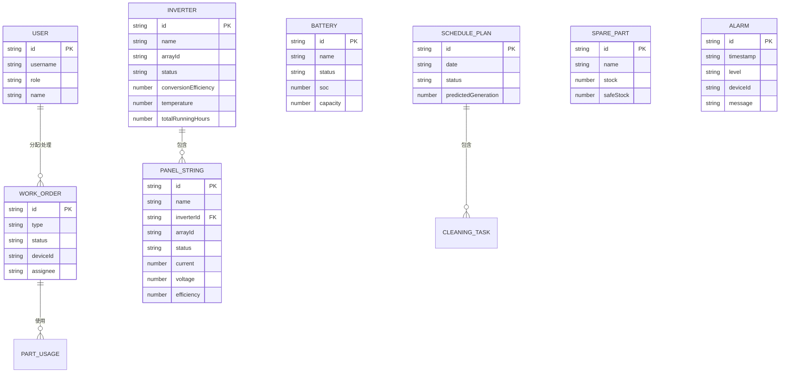

## 1. 架构设计



## 2. 技术描述

- **前端框架**: React 18 + TypeScript
- **构建工具**: Vite
- **状态管理**: Zustand
- **路由**: React Router DOM v6
- **UI样式**: TailwindCSS 3
- **图表可视化**: Recharts
- **图标库**: Lucide React
- **PDF导出**: jspdf + html2canvas
- **后端（Mock）**: Express 4（仅用于模拟真实API）
- **数据**: Mock 数据 + localStorage 持久化

## 3. 路由定义

| 路由 | 页面名称 | 用途 |
|------|----------|------|
| /login | 登录页 | 用户登录与角色认证 |
| /dashboard | 监控大屏 | 实时监控总览、气象数据、发电趋势、报警信息 |
| /scheduling | 发电调度 | 调度方案列表、方案审批、参数配置 |
| /devices | 设备运维 | 设备列表、状态监测、维保记录 |
| /workorders | 工单管理 | 维保工单列表、分配、跟踪 |
| /inventory | 库存管理 | 备件库存、出入库记录、库存预警 |
| /statistics | 统计报表 | 多维度数据统计、PDF报告导出 |
| /layout | 电站布局 | 可视化布局、热力图、设备状态分布 |

## 4. API 定义（Mock）

### 4.1 数据类型定义

```typescript
// 用户类型
interface User {
  id: string;
  username: string;
  role: 'admin' | 'manager' | 'operator';
  name: string;
}

// 实时气象数据
interface WeatherData {
  timestamp: string;
  irradiance: number;      // 光照辐射度 W/m²
  temperature: number;     // 环境温度 ℃
  windSpeed: number;       // 风速 m/s
  humidity: number;        // 湿度 %
  panelTemperature: number; // 组件温度 ℃
}

// 发电数据
interface GenerationData {
  timestamp: string;
  totalGeneration: number;   // 累计发电量 kWh
  realTimePower: number;     // 实时功率 kW
  dailyGeneration: number;   // 日发电量 kWh
}

// 逆变器
interface Inverter {
  id: string;
  name: string;
  arrayId: string;
  status: 'normal' | 'warning' | 'fault' | 'offline';
  conversionEfficiency: number; // 转换效率 %
  temperature: number;          // 温度 ℃
  inputVoltage: number;         // 输入电压 V
  outputCurrent: number;        // 输出电流 A
  outputPower: number;          // 输出功率 kW
  totalRunningHours: number;    // 累计运行时长 h
  faultRate: number;            // 故障率 %
}

// 组串
interface PanelString {
  id: string;
  name: string;
  arrayId: string;
  inverterId: string;
  status: 'normal' | 'warning' | 'fault' | 'offline';
  current: number;           // 电流 A
  voltage: number;           // 电压 V
  power: number;             // 功率 kW
  efficiency: number;        // 发电效率 %
  cleaningCycle: number;     // 距上次清洗天数
  needsCleaning: boolean;    // 是否需要清洗
}

// 储能电池
interface Battery {
  id: string;
  name: string;
  status: 'normal' | 'charging' | 'discharging' | 'fault';
  soc: number;               // 荷电状态 %
  voltage: number;           // 电压 V
  current: number;           // 电流 A
  temperature: number;       // 温度 ℃
  capacity: number;          // 容量 kWh
}

// 报警
interface Alarm {
  id: string;
  timestamp: string;
  level: 'critical' | 'warning' | 'info';
  deviceId: string;
  deviceType: 'inverter' | 'panel' | 'battery';
  deviceName: string;
  message: string;
  resolved: boolean;
}

// 调度方案
interface SchedulePlan {
  id: string;
  date: string;
  status: 'pending' | 'approved' | 'rejected' | 'executing' | 'completed';
  predictedGeneration: number;       // 预测发电量 kWh
  arrayPlans: ArrayPlan[];
  cleaningTasks: CleaningTask[];
  batteryPlan: BatteryPlan;
  approver?: string;
  approvedAt?: string;
  comment?: string;
  createdAt: string;
}

interface ArrayPlan {
  arrayId: string;
  arrayName: string;
  targetPower: number;           // 目标功率 kW
  efficiencyThreshold: number;   // 效率阈值 %
}

interface CleaningTask {
  arrayId: string;
  panelStringIds: string[];
  reason: string;
  efficiencyDrop: number;
}

interface BatteryPlan {
  minSoc: number;      // 最小SOC %
  maxSoc: number;      // 最大SOC %
  chargeFrom: string;  // 充电开始时间
  chargeTo: string;    // 充电结束时间
}

// 维保工单
interface WorkOrder {
  id: string;
  type: 'maintenance' | 'cleaning' | 'repair';
  status: 'pending' | 'assigned' | 'processing' | 'completed';
  deviceId: string;
  deviceType: 'inverter' | 'panel' | 'battery';
  deviceName: string;
  description: string;
  assignee?: string;
  team?: string;
  partsUsed: PartUsage[];
  createdAt: string;
  startedAt?: string;
  completedAt?: string;
}

interface PartUsage {
  partId: string;
  partName: string;
  quantity: number;
}

// 备件库存
interface SparePart {
  id: string;
  name: string;
  category: string;
  stock: number;
  safeStock: number;
  unit: string;
  lastUpdated: string;
}

// 出入库记录
interface StockRecord {
  id: string;
  partId: string;
  partName: string;
  type: 'in' | 'out';
  quantity: number;
  workOrderId?: string;
  operator: string;
  timestamp: string;
}

// 统计数据
interface StatisticsData {
  arrayId?: string;
  arrayName?: string;
  period: string;
  totalGeneration: number;     // 总发电量 kWh
  equivalentHours: number;     // 等效利用小时 h
  availability: number;        // 设备可用率 %
  peakPower: number;           // 峰值功率 kW
}
```

### 4.2 API 接口列表

| 接口 | 方法 | 描述 |
|------|------|------|
| /api/auth/login | POST | 用户登录 |
| /api/weather/realtime | GET | 获取实时气象数据 |
| /api/weather/history | GET | 获取历史气象数据 |
| /api/generation/realtime | GET | 获取实时发电数据 |
| /api/generation/trend | GET | 获取发电趋势数据 |
| /api/devices/inverters | GET | 获取逆变器列表 |
| /api/devices/panels | GET | 获取组件组串列表 |
| /api/devices/batteries | GET | 获取储能电池列表 |
| /api/alarms | GET | 获取报警列表 |
| /api/alarms/:id/resolve | PUT | 处理报警 |
| /api/schedules | GET | 获取调度方案列表 |
| /api/schedules/:id | GET | 获取调度方案详情 |
| /api/schedules/:id/approve | PUT | 审批调度方案 |
| /api/schedules/:id/reject | PUT | 驳回调度方案 |
| /api/workorders | GET | 获取工单列表 |
| /api/workorders | POST | 创建工单 |
| /api/workorders/:id/assign | PUT | 分配工单 |
| /api/workorders/:id/complete | PUT | 完成工单 |
| /api/inventory/parts | GET | 获取备件库存 |
| /api/inventory/records | GET | 获取出入库记录 |
| /api/statistics/summary | GET | 获取统计汇总数据 |
| /api/statistics/export | GET | 导出PDF报告 |

## 5. 数据模型


